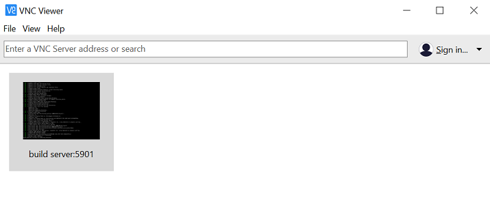
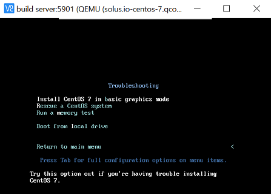

# SolusIO OS Images Builder

The repository was created by the SolusIO team. 

SolusIO comes with a number of OS images available out of the box.
However you may want to build your custom OS images (with desired parameters, installed packages, OS versions, and so on).

This repository will help you do so. It contains a number of scripts and configs 
to help you build custom `cloud-init` compatible QEMU/KVM OS images.

**Note:** SolusIO OS Images Builder was tested and it works on CentOS servers.
We сannot guarantee that it will work on Ubuntu or Debian.

## 1. Checking prerequisites

Check if the server where you want to build the image (or the build server for short) meets the following requirements:

- Free RAM: minimum 2048 MB (by default)
- Free HDD space: minimum 10 GB 
- Installed `qemu-kvm` package
- Installed Unzip and curl. To install them, run `yum install unzip curl` for CentOS.

## 2. Installing Packer

Install Packer by HashiCorp:

1. Access the build server command line via SSH.
2. Download Packer:

   `curl -k https://releases.hashicorp.com/packer/1.5.1/packer_1.5.1_linux_amd64.zip --output packer_1.5.1_linux_amd64.zip`

4. Unzip the Packer archive by running the `unzip packer_1.5.1_linux_amd64.zip` command.
5. Run the `cp packer /usr/sbin/` command to copy the Packer binary to the `/usr/sbin/` directory.

## 3. Downloading the repository and customizing the OS image

1. Download the content of the repository to the build server.
2. The repository contains directories named after OSes whose images you can build (`centos`, `debian`, `fedora`, and so on).
   To customize a future OS image, change the content of the JSON template file in the corresponding directory
   (for example, the `/centos/solus-centos-8.json` file).

   Examples of possible changes are below: 

   - To change the allocated memory (and most probably decrease the build time of an OS image),
     change the value of the `-m` parameter in `qemuargs`. 
   - To change the output OS image name, output directory, or disk size, change the corresponding parameter in the `"variables"`         section.

   **Note**: The disk size must be larger than the packed image size.

   For more information on customizing an OS image, [read the HashiCorp Packer documentation](https://www.packer.io/docs/builders/qemu).

## 4. Building an OS image

To start building an OS image, run the following command specifying the image OS as a parameter:

`./build.sh build debian|fedora|centos-8|windows-2019`

For example, if the image OS is Fedora, run the following command:

`./build.sh build fedora`

You can also launch some additional actions that will be executed with the build:

- To transfer a built OS image to another server via scp, run `./build.sh` with the `--opt_destination` option, for example:
`./build.sh build fedora --opt_destination=root@10.2.3.4:/`

  To use this option, you must also set up the SSH_KEY environment variable with a private SSH key of the destination server as the variable value.

- To clean up the output directory after removing a built OS image, run `./build.sh` with the `--cleanup` option.
This option may be useful if you transfer the image using the `--opt_destination` option. After the image was transferred, you may no longer need it in the output directory.

## 5. Troubleshooting

When you have launched the build, we recommend that you connect to the build server via VNC.
It will help you monitor the build and promptly see any errors if they occur.

**Note:** If Packer cannot find the location of the `qemu-kvm` package during the build, check the `"qemu_binary": "/.../.../qemu-kvm"`
line in the JSON template and edit the path to `qemu-kvm` if necessary.

## 6. Getting a built image

By default, the `./output` and the `./build` directories will be created during the script execution.
Once the build is finished, you will find the built OS image in the `./output` directory.
The `./build` directory will contain `packer.log`.

## Additional information

- For correct WinRM work, it is necessary to use SSL connection. It is already set up in the configs.
- To enable Windows updates, uncomment the corresponding code block in `html/Autounattend.xml` and 
  increase the disk size in the `.json` file.

